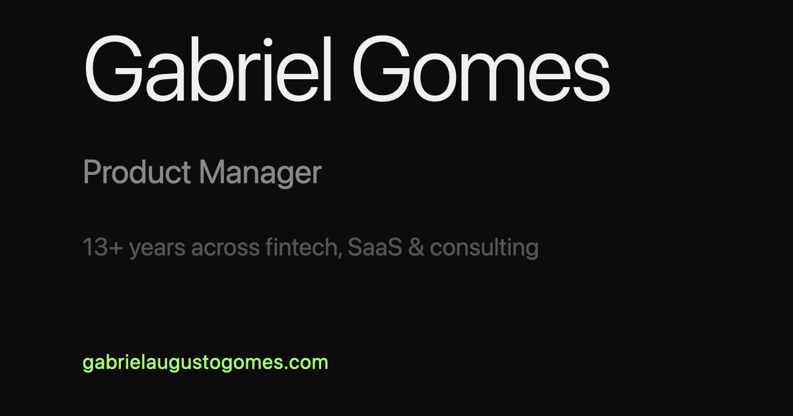

# gabrielaugustogomes.com

My personal website — built as a playground for experimenting with vibe coding tools.

Live at [gabrielaugustogomes.com](https://gabrielaugustogomes.com)



## Features

- EN / PT-BR bilingual with automatic browser language detection
- Entrance animations and scroll-based nav highlight
- Localized resume download
- Mobile responsive
- SEO + Open Graph tags for social sharing
- Analytics via Cloudflare

## Stack

- [Astro](https://astro.build) — site framework
- Vanilla CSS + JS — no UI library
- [Cloudflare Workers](https://workers.cloudflare.com) — hosting
- [GitHub](https://github.com) — version control & CI/CD

## Running locally

```bash
npm install
npm run dev
```

Opens at `http://localhost:4321`

## Deploying

Push to `main` — Cloudflare auto-deploys on every commit.

## License

MIT — feel free to use this as inspiration for your own site.
